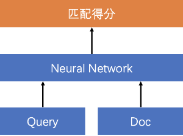
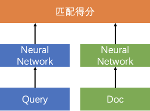
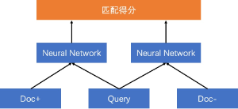
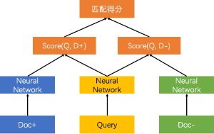

# 文本匹配

- 文本匹配是NLP中一个重要的基础问题，NLP中的许多任务都可以抽象为文本匹配任务，其通常以文本相似度计算、文本相关性计算的形式，在应用系统中起核心支撑作用。

## 代码结构

- 文本匹配任务位于./applications/tasks/text_matching

```plain
.
├── data                                                                                    ### 示例数据文件夹，包括各任务所需的训练集、测试集、验证集和预测集
│   ├── dev_data
│   │   └── dev.txt
│   ├── dev_data_tokenized
│   │   └── dev.txt
│   ├── dict
│   │   └── vocab.txt
│   ├── download_data.sh
│   ├── predict_data
│   │   └── infer.txt
│   ├── predict_data_tokenized
│   │   └── infer.txt
│   ├── test_data
│   │   └── test.txt
│   ├── test_data_tokenized
│   │   └── test.txt
│   ├── train_data_pairwise
│   │   └── train.txt
│   ├── train_data_pairwise_tokenized
│   │   └── train.txt
│   └── train_data_pointwise
│       └── train.txt
├── data_set_reader                                                                ### 与匹配任务相关的数据读取代码
│   └── ernie_classification_dataset_reader.py        ### 使用ERNIE的FC匹配任务专用的数据读取代码
├── examples                                                                            ### 各典型网络的json配置文件，infer后缀的为对应的预测配置文件
│   ├── mtch_bow_pairwise_ch_infer.json
│   ├── mtch_bow_pairwise_ch.json
│   ├── mtch_ernie_fc_pointwise_ch_infer.json
│   ├── mtch_ernie_fc_pointwise_ch.json
│   ├── mtch_ernie_pairwise_simnet_ch_infer.json
│   ├── mtch_ernie_pairwise_simnet_ch.json
│   ├── mtch_ernie_pointwise_simnet_ch_infer.json
│   └── mtch_ernie_pointwise_simnet_ch.json
├── inference                                                                            ### 模型预测代码
│   └── custom_inference.py                                                ### 文本匹配任务通用的模型预测代码
├── model                                                                                    ### 文本匹配任务相关的网络文件
│   ├── base_matching.py
│   ├── bow_matching_pairwise.py
│   ├── ernie_matching_fc_pointwise.py
│   ├── ernie_matching_siamese_pairwise.py
│   └── ernie_matching_siamese_pointwise.py
├── run_infer.py                                                                    ### 依靠json进行模型预测的入口脚本
├── run_trainer.py                                                                ### 依靠json进行模型训练的入口脚本
└── trainer                                                                                ### 模型训练和评估代码
    ├── custom_dynamic_trainer.py                                    ### 动态库模式下的模型训练评估代码
    └── custom_trainer.py                                                    ### 静态图模式下的模型训练评估代码
```

## 准备工作

### 数据准备

- 在文心中，基于ERNIE的模型都不需要用户自己分词和生成词表文件，非ERNIE的模型需要用户自己提前切好词，词之间以空格分隔，并生成词表文件。切词和词表生成可以使用「[分词工具与词表生成工具](../../tools/data/wordseg/README.md)」进行处理。
- 文心中的所有数据集、包含词表文件、label_map文件等都必须为为utf-8格式，如果你的数据是其他格式，请使用「[编码识别及转换工具](../../tools/data/data_cleaning/README.md)」进行格式转换。
- 在文本匹配任务中，根据其训练方式的不同，训练集分为Pointwise和Pairwise两种格式，测试集、验证集和预测集的格式相同。
- 非ERNIE数据的pointwise训练集、pairwise训练集、测试集、验证集和预测集分别存放在./applications/tasks/text_matching/data目录下的train_data_pointwise_tokenized、train_data_pairwise_tokenized、test_data_tokenized、dev_data_tokenized和predict_data_tokenized文件夹下。
- ERNIE数据的pointwise训练集、pairwise训练集、测试集、验证集和预测集分别存放在./applications/tasks/text_matching/data目录下的train_data_pointwise、train_data_pairwise、test_data、dev_data和predict_data文件夹下。

#### **非ERNIE模型数据**

##### 训练集

- Pointwise训练集：数据分为三列，列与列之间用**\t**分割。前两列为文本，最后一列为标签。

```plain
喜欢 打篮球 的 男生 喜欢 什么样 的 女生    爱 打篮球 的 男生 喜欢 什么样 的 女生   1
我 手机 丢 了 ， 我 想 换 个 手机    我 想 买 个 新手机 ， 求 推荐   1
大家 觉得 她 好看 吗    大家 觉得 跑 男 好看 吗 ？  0
```

- Pairwise训练集：数据分为三列，列与列之间用**\t**分割，以query和文章标题匹配任务为例，第一列为query，第二列为正例标题pos_titile，第三列为负例标题neg_title。

```plain
喜欢 打篮球 的 男生 喜欢 什么样 的 女生    爱 打篮球 的 男生 喜欢 什么样 的 女生    爱情 里 没有 谁 对 谁错 吗 ？
我 手机 丢 了 ， 我 想 换 个 手机    我 想 买 个 新手机 ， 求 推荐    剑灵 高级 衣料 怎么 得
大家 觉得 她 好看 吗    大家 觉得 跑 男 好看 吗 ？    照片 怎么 变成 漫画
```

##### 测试集/验证集

- 测试集/验证集样例如下所示，数据分为三列，列与列之间用**\t**进行分隔，前两列为文本，最后一列为标签。

```plain
我 姓 王 图片 怎么 制作    制作 文字 图片	0
为什么 鱼 会 被 淹死    为什么 鱼 会 淹死	1
深圳 如何 过 澳门    深圳 去 澳门 该 怎样 去	1
```

##### 预测集

- 预测集样例如下所示，预测集无需进行标签预占位，数据为两列文本，两列文本之间使用**\t**进行分隔。

```plain
图片 上 得 牌子 是 什么    图片 上 是 什么 牌子 的 包
芹菜 包 什么 肉 好吃    芹菜 炒 啥 好吃
汽车 坐垫 什么 牌子 好 ？    什么 牌子 的 汽车 坐垫 好
```

##### 词表

- 非ERNIE模型的词表文件示例存放在**./applications/tasks/text_matching/data/dict/vocab.txt**：词表分为两列，第一列为词，第二列为id（从0开始），列与列之间用**\t**进行分隔。文心的词表中**，**[PAD]、[CLS]、[SEP]、[MASK]、[UNK]这5个词是必须要有的，若用户自备词表，需保证这5个词是存在的。部分词表示例如下所示：

```plain
[PAD]	0
[CLS]	1
[SEP]	2
[MASK]	3
的	4
这个	5
您好	6
...
[UNK]   1566
```

#### **ERNIE模型数据**

##### 训练集

- ERNIE数据集与非ERNIE数据集格式一致，不同之处在于不用分词
- Pointwise训练集：数据分为三列，列与列之间用**\t**分割。前两列为文本，最后一列为标签。

```plain
喜欢打篮球的男生喜欢什么样的女生	爱打篮球的男生喜欢什么样的女生	1
我手机丢了，我想换个手机	我想买个新手机，求推荐	1
大家觉得她好看吗	大家觉得跑男好看吗？	0
求秋色之空漫画全集	求秋色之空全集漫画	1
晚上睡觉带着耳机听音乐有什么害处吗？	孕妇可以戴耳机听音乐吗?	0
```

- Pairwise训练集：数据分为三列，列与列之间用**\t**分割，以query和文章标题匹配任务为例，第一列为query，第二列为正例标题pos_titile，第三列为负例标题neg_title。

```shell
喜欢打篮球的男生喜欢什么样的女生	爱打篮球的男生喜欢什么样的女生	这边的状态显示是等待确认的
我手机丢了，我想换个手机	我想买个新手机，求推荐	求一本小说是和攻撕逼的
大家觉得她好看吗	大家觉得跑男好看吗？	四川商务职业学院好不好呀
求秋色之空漫画全集	求秋色之空全集漫画	杂志社摄影照片投稿
晚上睡觉带着耳机听音乐有什么害处吗？	孕妇可以戴耳机听音乐吗?	给姓全的男生起外号
```

##### 测试集/验证集

- ERNIE数据集与非ERNIE数据集格式一致，不同之处在于不用分词
- 测试集/验证集样例如下所示，数据分为三列，列与列之间用**\t**进行分隔，前两列为文本，最后一列为标签。

```shell
尺有所短，后面是什么	尺有所短，后面写什么	1
为什么恐怖片会吓死人	为什么恐怖片会吓死人？	1
这是什么舞？(图片)	这是什么枪图片如下	0
这是什么意思，翻译一下	翻译一下这是什么意思	1
```

##### 预测集

- ERNIE数据集与非ERNIE数据集格式一致，不同之处在于不用分词
- 预测集样例如下所示，预测集无需进行标签预占位，数据为两列文本，两列文本之间使用**\t**进行分隔。

```shell
海 尔 全 自 动 洗 衣 机 怎 么 样 海 尔 全 自 动 洗 衣 机 怎 么 样	海 尔 全 自 动 洗 衣 机 怎 么 用 海 尔 全 自 动 洗 衣 机 怎 么 用
在 家 电 脑 做 什 么 兼 职 好 呢 在 家 电 脑 做 什 么 兼 职 好 呢	两 台 电 脑 做 什 么 兼 职 好 呢 两 台 电 脑 做 什 么 兼 职 好 呢
这 是 什 么 动 漫 的 图 片 啊 } 这 是 什 么 动 漫 的 图 片 啊 }	这 是 动 漫 还 是 图 片 这 是 动 漫 还 是 图 片
```

##### 词表

- ERNIE词表文件格式与非ERNIE的格式一致，ERNIE词表由文心model提供，./applications/models_hub路径下各ERNIE模型文件夹下存在着对应的词表文件，用户可根据需要进行选择，具体示例如下所示：

```plain
[PAD]    0
[CLS]    1
[SEP]    2
[MASK]   3
，    4
的    5
、    6
一    7
人    8
```

### 网络（模型）选择

- 文心预置的可用于文本分类的模型源文件在applications/tasks/text_matching/model目录下，在介绍具体的模型前先对文本匹配网络涉及到的概念进行描述。

|           | 单塔            | 双塔            |
| --------- | --------------- | --------------- |
| Pointwise |  |  |
| Pairwise  |  |  |

- Pointwise/Pairwise
  - Pointwise：输入两个文本和一个标签，可看作为一个分类问题，即判断输入的两个文本是否匹配。
  - Pairwise：输入为三个文本，分别为Query以及对应的正样本和负样本，该训练方式考虑到了文本之间的相对顺序。
- 单塔/双塔
  - 单塔：先将输入文本合并，然后输入到单一的神经网络模型。
  - 双塔：对输入文本分别进行编码成固定长度的向量，通过文本的表示向量进行交互计算得到文本之间的关系。
- 各个模型的特点如下所示：

| 网络名称（py文件的类名）                                     | 简介                                                         | 支持类型  | 支持预训练模型                                               |
| ------------------------------------------------------------ | ------------------------------------------------------------ | --------- | ------------------------------------------------------------ |
| BowMatchingPairwise(bow_matching_pairwise.py)                | 词袋模型，不考虑句子语序，用一组无序单词来表达一段文本；Pairwise双塔模型。 | Pairwise  | ERNIE2.0-Base、ERNIE2.0-large、ERNIE3.0-Base、ERNIE3.0-x-Base、ERNIE3.0-Medium |
| ErnieMatchingFcPointwise(ernie_matching_fc_pointwise)        | 增加ERNIE预训练模型，下游网络为基础的文本匹配模型，可以任意搭配其他各种经典网络；Pointwise单塔模型。 | Pointwise | ERNIE2.0-Base、ERNIE2.0-large、ERNIE3.0-Base、ERNIE3.0-x-Base、ERNIE3.0-Medium |
| ErnieMatchingSiamesePairwise(ernie_matching_siamese_pairwise.py) | 增加ERNIE预训练模型，下游网络采用余弦相似度作为匹配度计算，损失函数为合页损失函数；Pairwise双塔模型。 | Pairwise  | ERNIE2.0-Base、ERNIE2.0-large、ERNIE3.0-Base、ERNIE3.0-x-Base、ERNIE3.0-Medium |
| ErnieMatchingSiamesePointwise(ernie_matching_siamese_pointwise.py) | 增加ERNIE预训练模型，下游网络采用长短期记忆网络，可较好地处理序列文本中长距离依赖的问题；Pointwise双塔模型； | Pointwise | ERNIE2.0-Base、ERNIE2.0-large、ERNIE3.0-Base、ERNIE3.0-x-Base、ERNIE3.0-Medium、ERNIE-M |

### ERNIE预训练模型下载

- 文心提供的[ERNIE预训练模型](../../models_hub/README.md)的下载脚本在applications/models_hub目录下，各预训练模型可由对应的download_xx.sh文件下载得到，用户可根据需求自行下载。其中，ernie_config.json为ERNIE预训练模型的配置文件，vocab.txt为ERNIE预训练模型的词表文件，params目录为ERNIE预训练模型的参数文件目录。

| 模型名称        | 下载脚本                           | 备注                                       |
| --------------- | ---------------------------------- | ------------------------------------------ |
| ERNIE2.0-Base   | sh download_ernie_2.0_base_ch.sh   | 下载并解压后得到对应模型的参数、字典和配置 |
| ERNIE2.0-large  | sh download_ernie_2.0_large_ch.sh  |                                            |
| ERNIE3.0-Base   | sh download_ernie_3.0_base_ch.sh   |                                            |
| ERNIE3.0-x-Base | sh download_ernie_3.0_x_base_ch.sh |                                            |
| ERNIE3.0-Medium | sh download_ernie_3.0_medium.sh    |                                            |

### 模型评估指标选择

匹配任务常用的指标有：Acc（准确率）、Precision（精确率）、Recall（召回率）、pn（正逆序比）、Auc、F1等

### 运行环境选择

- 非ERNIE网络，优先考虑CPU机器
- ERNIE网络优先考虑GPU机器，显存大小最好在10G以上。

## 开始训练

- 进入指定任务目录./applications/tasks/text_matching

```shell
cd ./applications/tasks/text_matching
```

### 训练的配置文件

- 配置文件：在./example目录下，根据不同的模型有4种配置文件
  - mtch_bow_pairwise_ch.json：BowMatchingPairwise模型的配置文件
  - mtch_ernie_fc_pointwise_ch.json：ErnieMatchingFcPointwise模型的配置文件
  - mtch_ernie_pairwise_simnet_ch.json：ErnieMatchingSiamesePairwise模型的配置文件
  - mtch_ernie_pointwise_simnet_ch.json：ErnieMatchingSiamesePointwise模型的配置文件

```plain
├── examples                                                                            ### 各典型网络的json配置文件，infer后缀的为对应的预测配置文件
│   ├── mtch_bow_pairwise_ch.json
│   ├── mtch_ernie_fc_pointwise_ch.json
│   ├── mtch_ernie_pairwise_simnet_ch.json
│   └── mtch_ernie_pointwise_simnet_ch.json
```

### 训练模型

- 使用run_trainer.py脚本加载不同的配置文件从而训练不同的模型

```shell
#训练BowMatchingPairwise模型
python run_trainer.py --param_path ./examples/mtch_bow_pairwise_ch.json

#训练ErnieMatchingFcPointwise模型
python run_trainer.py --param_path ./examples/mtch_ernie_fc_pointwise_ch.json

#训练ErnieMatchingSiamesePairwise模型
python run_trainer.py --param_path ./examples/mtch_ernie_pairwise_simnet_ch.json

#训练ErnieMatchingSiamesePointwise模型
python run_trainer.py --param_path ./examples/mtch_ernie_pointwise_simnet_ch.json
```


## 开始预测

### 预测的配置文件

- 配置文件：在./example目录下，根据不同的模型有4种配置文件，需要根据具体情况修改配置文件下加载模型的路径（json配置文件中“inference_model_path”关键字）
  - mtch_bow_pairwise_ch_infer.json：BowMatchingPairwise模型的配置文件
  - mtch_ernie_fc_pointwise_ch_infer.json：ErnieMatchingFcPointwise模型的配置文件
  - mtch_ernie_pairwise_simnet_ch_infer.json：ErnieMatchingSiamesePairwise模型的配置文件
  - mtch_ernie_pointwise_simnet_ch_infer.json：ErnieMatchingSiamesePointwise模型的配置文件
- 在配置文件中需要更改 inference.inference_model_path 为上面训练过程中所保存的**预测模型的路径**

```shell
├── examples                                                                            ### 各典型网络的json配置文件，infer后缀的为对应的预测配置文件
│   ├── mtch_bow_pairwise_ch_infer.json
│   ├── mtch_ernie_fc_pointwise_ch_infer.json
│   ├── mtch_ernie_pairwise_simnet_ch_infer.json
│   ├── mtch_ernie_pointwise_simnet_ch_infer.json
```

### 预测模型

```shell
#预测BowMatchingPairwise模型
python run_infer.py --param_path ./examples/mtch_bow_pairwise_ch_infer.json

#预测ErnieMatchingFcPointwise模型
python run_infer.py --param_path ./examples/mtch_ernie_fc_pointwise_ch_infer.json

#预测ErnieMatchingSiamesePairwise模型
python run_infer.py --param_path ./examples/mtch_ernie_pairwise_simnet_ch_infer.json

#预测ErnieMatchingSiamesePointwise模型
python run_infer.py --param_path ./examples/mtch_ernie_pointwise_simnet_ch_infer.json
```